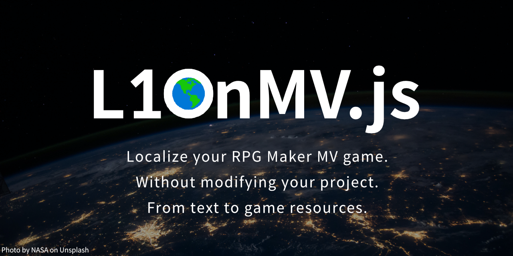

<p align="center">
  
</p>

### [Download plugin](https://github.com/Creta5164/L10nMV.js/releases)

This plugin provides localization feature to RPG Maker MV.  
Created by Creta Park (https://creft.me/cretapark)  
<a href="https://www.buymeacoffee.com/CretaPark" target="_blank"></a>

This plugin is free for use, just leave my name in your game's credits!

*Currently recommanded MV version is `1.6.2`.*

---

## Update from old version guide
1. Double-click `L10nMV` in plugin management menu
2. Change to other plugin and restore it to `L10nMV`.  
   (Doesn't need re-writting plugin parameters!)
3. Click 'OK' to apply and save your project.
4. Run your game and check developer console.

---

## Demonstration

If you curious what it looks like, take tour this video!  
[](https://youtu.be/YfCC8id8ePQ)

---

# Table of content
 1. [Preparation](#1-Preparation)
 2. [How to use](#2-How-to-use)  
   2.1. [Generate template language pack](#21-Generate-template-language-pack)  
   2.2. [Replace images, sounds](#22-Replace-images-sounds)  
   2.3. [Apply to extra plugins](#23-Apply-to-extra-plugins)  
 3. [Plugin options](#3-Plugin-options)
 4. [Third-party library/sources notice](#4-Third-party-librarysources-notice)

# [1.](#Table-of-content) Preparation
Create `lang` directory in your MV project.

# [2.](#Table-of-content) How to use 
Basically, `L10nMV` automatically links localized text from `lang` directory files to game.
If player uses default-language value then `L10nMV` uses default resources in your game.

If you want to support other languages must add language pack directory in `lang` directory.  
Language pack directory name must be ISO 639-1 code.  
(i.e. `en`, `ko`, `ja`, `es`, `ru`...)

It's should be like this :

```diff
 /'Your project directory'
    /audio
    /data
    /icon
    /img
    /js
+   /lang
+      /en
+      /ja
    /movies
    /save
    /Game.rpgproject
    /index.html
```

## [2.1.](#Table-of-content) Generate template language pack
Template language pack is that text scripts from your project.  
You can make that using by `L10nMVEditor.js` plugin.  
Just follow instruction of plugin then you can localize every text from your project.

## [2.2.](#Table-of-content) Replace images, sounds
Replacing image and sound is easy to do.  
Create the same folder in the language pack folder as the project's resource folder.

For example, if you want to replace bgm, se, and some picture...

```diff
   /lang                  # English version has dubbed version!
      /en                 # Oh, and also dubbed voicelines!
+        /audio
+           /bgm
+              /EndingSong.ogg
+           /se
+              /HeroAttackSound_1.ogg
+              /HeroDefeated_1.ogg
+              /HeroDefeated_2.ogg
+        /img           # I need replace some pictures!
+           /pictures
+              /StandingCG_HeroIdle.png
```

If you put a resource with the name of the resource you want to replace into this directory, `L10nMV` will take over that resource in the directory instead of the original resource by state of current language.

### When default language and current language is same :
`L10nMV` will take original resources.  
> img/pictures/myImage.png  
> audio/me/victory.ogg  

### But if not same language :
*(i.e. current language is 'ja', default language is 'en')*

`L10nMV` will find alternative resources.  
> lang/ja/img/pictures/myImage.png  
> lang/ja/audio/me/victory.ogg  

\* Note that replacing audio is great for dubbed game scenario.

## [2.3.](#Table-of-content) Apply to extra plugins

**[ IMPORTANT ]** If you want to use localization plugins feature, you must put this plugin at top of plugin list.

Plugins that you want to localize them should be added to plugin whitelist of this plugin's parameters.

`L10nMV` take replace values only whitelisted plugin.

# [3.](#Table-of-content) Plugin options

### Default language
> Default language you've written in your project.  
> Must be use ISO 639-1 code. (i.e. ko, en...)

### Global language
> This is fallbacks if player uses not supported language.  
> Must be use ISO 639-1 code. (i.e. ko, en...)

### Specified supported language pack list
> **\* Strongly recommanded for Web, Mobile, UWP environment.**  
> This list is used when limited modding environment.  
> (Unofficial translation is cannot try on Web and Mobile)  
> If you hosting your game in limited environment, consider use
> this option.  
> Must be use ISO 639-1 code. (i.e. ko, en, ja...)

### Strict mode
> Basically, when `L10nMV` can't find same pair of language pack
> file, then `L10nMV` uses default resources in your project.  
> If you use strict mode, `L10nMV` throws error instead using
> default resources.

### Whitelisted plugins
> `L10nMV` doesn't apply replacing every plugins parameters.  
> You must add whitelist plugin's name into here.

###  Ignore decrypt language pack files
> Basically, RPG MV supports encrypt files in distribution.  
> this option supports replace files in language pack easily.  
> but if you want presenting fully official language only
> then turn off this option.

# [4.](#Table-of-content) Third-party library/sources notice

- [deep-merge.js](https://gist.github.com/ahtcx/0cd94e62691f539160b32ecda18af3d6)

---

# L10nMVEditor.js
This plugin helps making new language pack for L10nMV plugin.

Step to exporting language pack template :

0. Finish your game after completing the inspection of your game  
   **\* This is important for quality of your game!**
1. Enable this plugin into your project.
2. Start test play.
3. Open developer console. (press <kbd>F12</kbd>)
4. In `Console` tab, type `L10nMVEditor.CreateTemplate()`.
5. When it's done, `lang/exported` directory is created in your
   project. This is everything of your project's text data.
6. Change `exported` directory to localization target country
   code. (ISO 639-1)  
   *i.e. : `ko`, `en`, `jp`, `ca`, `ru`...*
7. Open the files in the folder with a text editor and edit the
   text according to localize them what do you want.
8. If you want your game allow translate from unofficial, you leave exported language pack in your public release build for make help them translate easy way your game.

Note. If you need make font atlas (image based font set), Open developer console as same step 3, and type `L10nMVEditor.CreateAllUsedGlyphFromPack("iso682-1 code")`.  
Then L10nMVEditor generates all text of language pack.

For example :  
`L10nMVEditor.CreateAllUsedGlyphFromPack("en")`  
-> exports texts to english(en) language pack.

`L10nMVEditor.CreateAllUsedGlyphFromPack("ja")`  
-> exports texts to japanese(ja) language pack.
